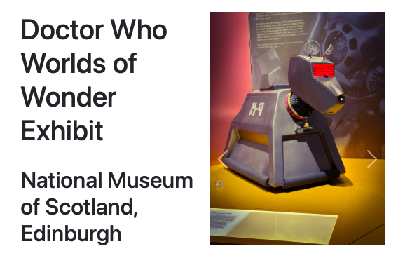
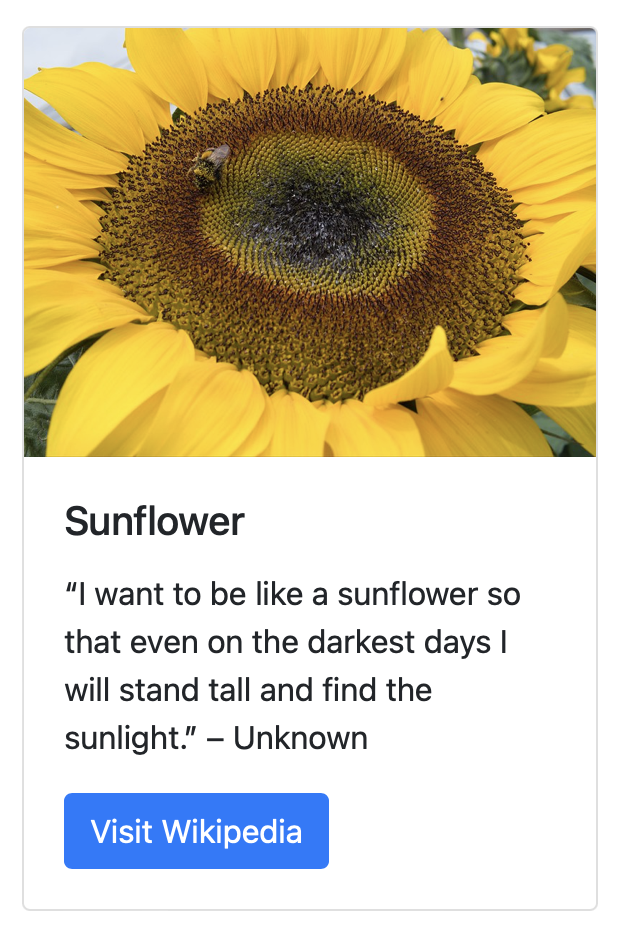
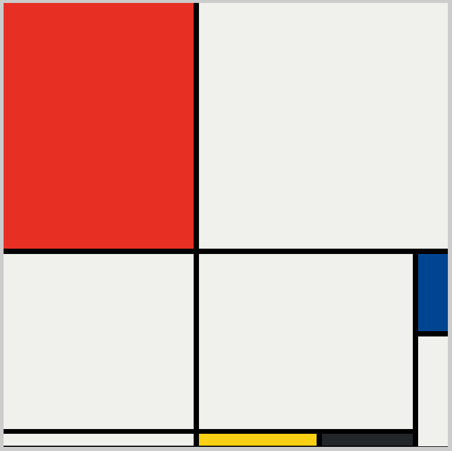

# html-css-projects
A personal repo for learning and experimentation.

### [carousel-bootstrap - 20241231](https://github.com/mirella4real/html-css-projects/tree/main/carousel-bootstrap)

Combining Bootstrap carousel component with Grid and Flex for alignment. Photos in the carousel taken at the Doctor Who Worlds of Wonder exhibit in Edinburgh, Scotland, by Mirella Batista. Project from the [Appbrewery The Complete Web Development Bootcamp](https://www.udemy.com/course/the-complete-web-development-bootcamp/) course.

### [intro-bootstrap - 20241227](https://github.com/mirella4real/html-css-projects/tree/main/intro-bootstrap)

Learning Bootstrap. Project from the [Appbrewery The Complete Web Development Bootcamp](https://www.udemy.com/course/the-complete-web-development-bootcamp/) course.

### [mondrian-painting - 20241225](https://github.com/mirella4real/html-css-projects/tree/main/mondrian-painting)

Using the CSS Grid to replicate a Mondrian painting. Project from the [Appbrewery The Complete Web Development Bootcamp](https://www.udemy.com/course/the-complete-web-development-bootcamp/) course.

